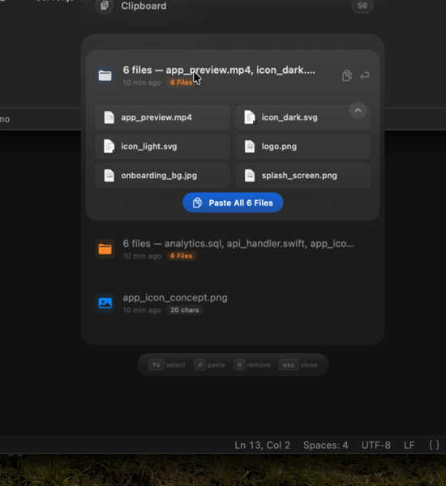
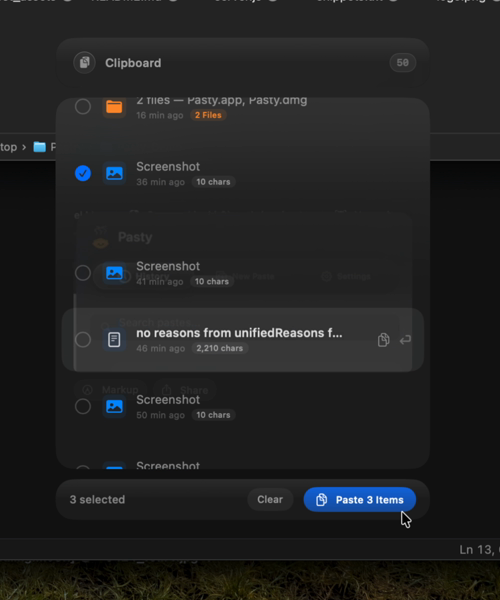
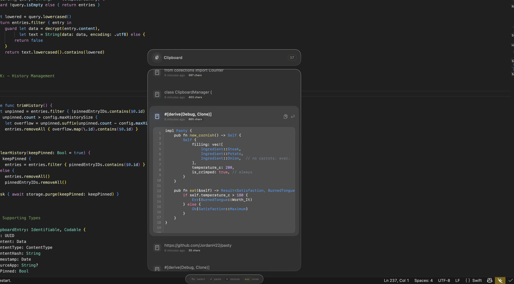
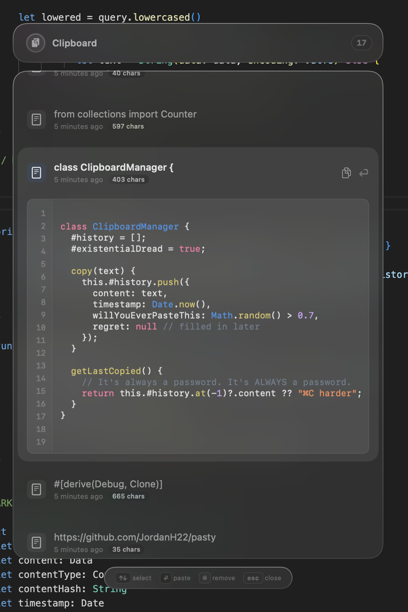
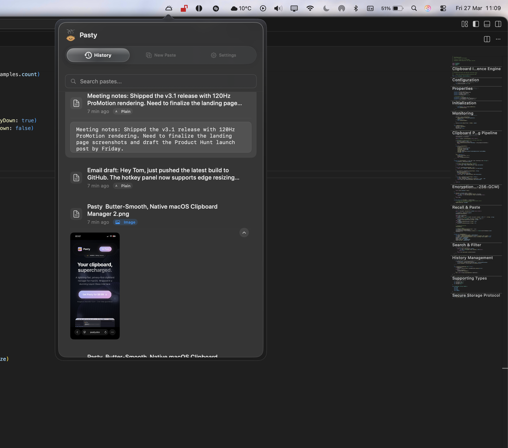
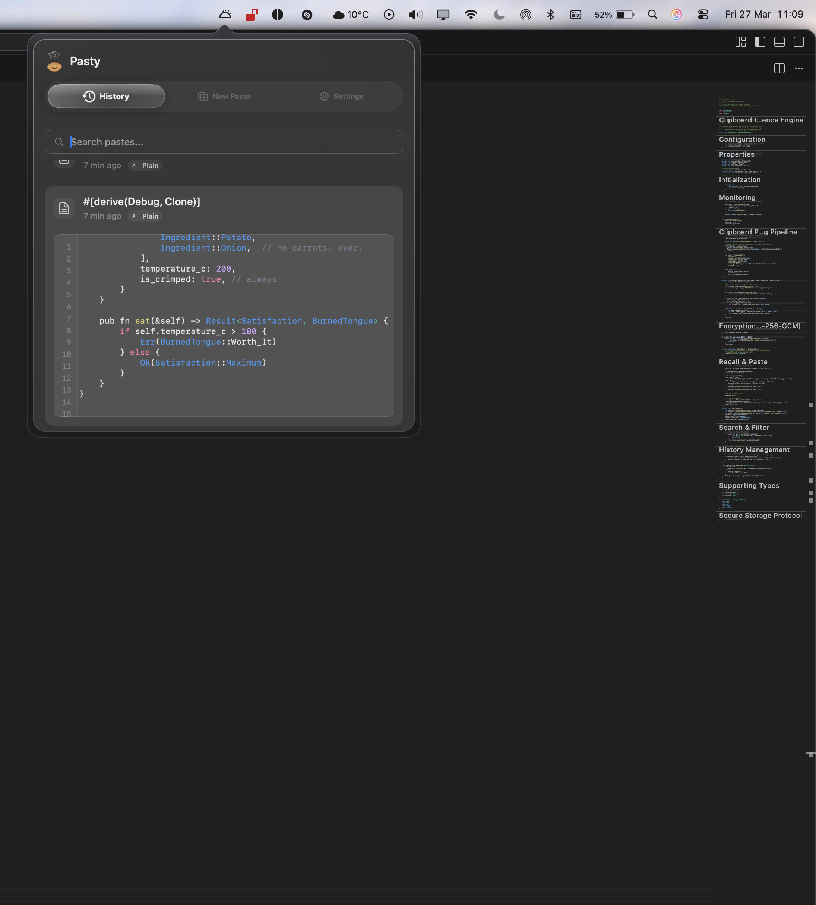

<p align="center">
  
</p>

<h1 align="center">Pasty</h1>

<p align="center">
  <strong>Butter-Smooth, Native macOS Clipboard Manager</strong><br>
  An impossibly fast, completely private copy history engine wrapped in a stunning Liquid Glass interface.
</p>

<p align="center">
  <a href="https://pasty.dev"></a>
  <a href="https://pasty.dev/#pricing"></a>
  <a href="https://github.com/JordanH22/pasty/releases"></a>
</p>

---

## ✨ Features

- **Multi-File Batch Paste** — Copy 6, 10, even 20 files. They group into a single clipboard entry. Expand to see every file, then paste all at once.
- **⌘-Hold Dynamic Tick Boxes** — Hold ⌘ to reveal checkboxes on each item. Pick exactly what you need and paste the selection in one shot. Works with files, text, and images.
- **100% Native Swift** — Built from the hardware level up using native macOS frameworks. Zero Electron. Zero Chromium. Unmatched battery efficiency.
- **120Hz ProMotion Optimized** — Animations, scrolling, and menus are flawlessly tied to the display refresh rate.
- **Syntax Highlighting** — Auto-detects code snippets with full syntax highlighting across **30+ languages**.
- **Screenshot & Recording Capture** — Every ⌘⇧3/4/5 screenshot and screen recording is captured directly with rich previews.
- **Pin & Expand Previews** — Hover any paste to peek. Click to pin it open with fluid spring animations.
- **Drag-to-Resize** — Grab any edge or corner to resize. Both panels remember your preferred size between sessions.
- **Extreme Privacy** — No analytics or telemetry. Your clipboard history never leaves your hard drive. AES-256 encrypted locally.
- **Liquid Glass UI** — Deep desktop-level blur matrices, glassmorphic panels, and organic spring animations.

## 📸 Screenshots

<table>
  <tr>
    <td></td>
    <td></td>
  </tr>
  <tr>
    <td align="center"><em>Multi-file batch paste — expanded view</em></td>
    <td align="center"><em>⌘-hold tick boxes — selective paste</em></td>
  </tr>
  <tr>
    <td></td>
    <td></td>
  </tr>
  <tr>
    <td align="center"><em>Code view with syntax highlighting</em></td>
    <td align="center"><em>Expanded preview with line numbers</em></td>
  </tr>
  <tr>
    <td></td>
    <td></td>
  </tr>
  <tr>
    <td align="center"><em>Menu bar popover with full history</em></td>
    <td align="center"><em>Clean search filtering</em></td>
  </tr>
</table>

> **Note:** This repository serves exclusively as the public issue tracker, community discussion forum, and binary distribution hub for Pasty. The application source code is private.

## 🚀 Installation

### Option 1: Direct Download
Download the latest `Pasty.dmg` directly from the [Releases Page](https://github.com/JordanH22/pasty/releases/latest).

### Option 2: Homebrew (Recommended)
If you prefer Terminal administration, you can install Pasty using the official Homebrew Cask:
```bash
brew install --cask pasty
```

## 🔑 Licensing

Pasty is a paid, commercial application. Upon launching, you will be prompted for your Lemon Squeezy License Key.
You can purchase a Lifetime License directly at [pasty.dev](https://pasty.dev).

## 🐛 Bug Reports & Feature Requests

Encountered an issue or have an idea to make Pasty even better? 
Please submit an issue here on GitHub!

1. Check the [Issues Tab](https://github.com/JordanH22/pasty/issues) to ensure it hasn't been reported yet.
2. Explain the bug or feature request clearly.
3. If it's a bug, please include your macOS version (requires 15.0+).

## 💬 Community

Have questions? Want to share a cool workflow? Join the [GitHub Discussions](https://github.com/JordanH22/pasty/discussions) tab above.

<br>
<p align="center">
  <i>Crafted for macOS with ♥ by an indie developer</i>
</p>
